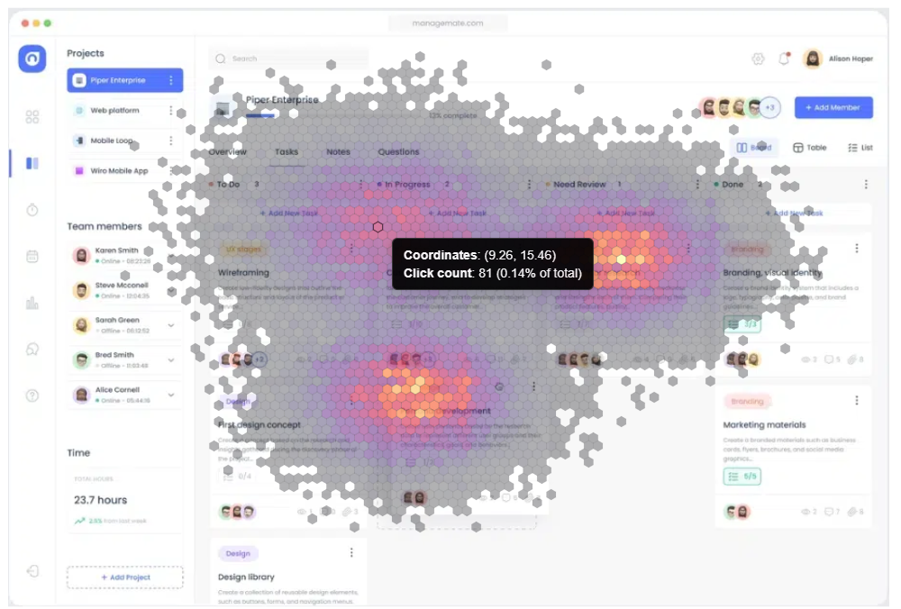

# Luzmo Custom Chart Examples

This repository contains **example implementations of custom charts** created by Luzmo employees, and goes hand-in-hand with [the `custom-chart-builder` repository](https://github.com/luzmo-official/custom-chart-builder) that's used while developing Custom charts.

The goal is to provide inspiration and reference material for Luzmo customers who want to build their own custom visualizations!

## ⚠️ Important Notes & Warnings

* **Might not be production-ready**: These examples may contain bugs, limitations, or suboptimal implementations. They should **not** be used in production without thorough testing and validation.
* **No maintenance or enhancements**: We do not plan to extend or actively maintain these examples. Future updates or fixes are unlikely.

## Available Custom Charts

| Chart name                 | Screenshot | Description                              | Source code                                            |
|----------------------------|------------|------------------------------------------|--------------------------------------------------------|
| Aggregated scatter chart  |  | A scatter chart which aggregates the values that coincide both in the x-axis and group-by column  | [Source code](./aggregated-scatter-chart) |
| Click density map  |  | Visualizes click frequency on a website using hexagonal bins and color intensity. | [Source code](./click-density-map) |
| Custom grouped bar chart   |  | A simple grouped bar chart, created with D3.js.  | [Source code](./custom-grouped-bar-chart) |
| Waterfall chart     |  | Visualizes step-by-step value changes from an initial value. | [Source code](./waterfall-chart) |
| Financial table     |  | Table with aggregation for subcategories. | [Source code](./financial-table) |
| Small Multiples Widget     | <video muted autoplay loop src="https://github.com/user-attachments/assets/5745cdbf-4bba-4e14-89d8-88c0bb9e40c9" width="300" />  | Individual chart tiles per dimension. | [Source code](./small-multiples-widget) |

## Contributing

We welcome external contributions! 🎉

If you’d like to improve an existing example or add a new one, please open a pull request.
Our team will review contributions on a best-effort basis!
