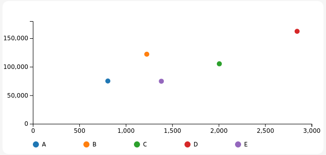

# Custom Chart - Aggregated scatter chart

A scatter chart which aggregates the values that coincide both in the x-axis and group-by column.

## Using in Luzmo

Upload `bundle.zip` in the Luzmo app in [your Profile settings -> Custom charts](https://app.luzmo.com/settings/custom-charts)

## Development

See Custom Chart Builder repository [luzmo-official/custom-chart-builder](https://github.com/luzmo-official/custom-chart-builder). 

You'll want to copy-paste the `package.json` file and the `src` directory from here into `/projects/custom-chart` of that repository (replacing all existing files).
