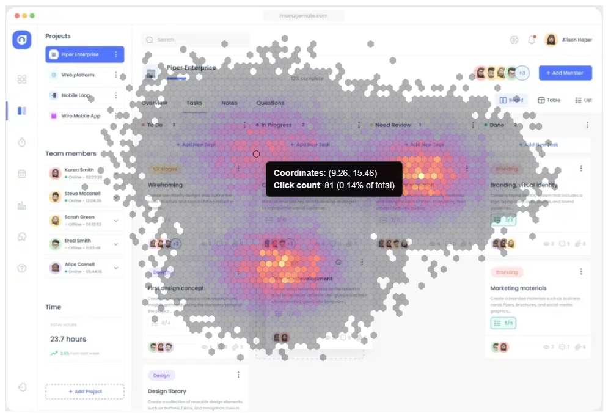

# Custom Chart - Click density map

This click density map shows where users click most frequently on a user interface by plotting the X and Y coordinates of each click and aggregating them into hexagonal bins. The color intensity of each hexagon represents the relative density of clicks in that area: lighter colors indicate fewer clicks, darker or warmer colors indicate higher activity.

The data it expects are pairs of numerical values:
- X coordinate: the horizontal position of a click on the screen.
- Y coordinate: the vertical position of a click on the screen.

Each row in the dataset is one click event, represented as [x, y]. With large datasets, patterns of interaction emerge, highlighting which parts of the interface attract the most user attention and interaction.

In this example, the background image URL is hardcoded in the chart.

## Using in Luzmo

Upload `bundle.zip` in the Luzmo app in [your Profile settings -> Custom charts](https://app.luzmo.com/settings/custom-charts)

## Development

See Custom Chart Builder repository [luzmo-official/custom-chart-builder](https://github.com/luzmo-official/custom-chart-builder). 

You'll want to copy-paste the `package.json` file and the `src` directory from here into `/projects/custom-chart` of that repository (replacing all existing files).