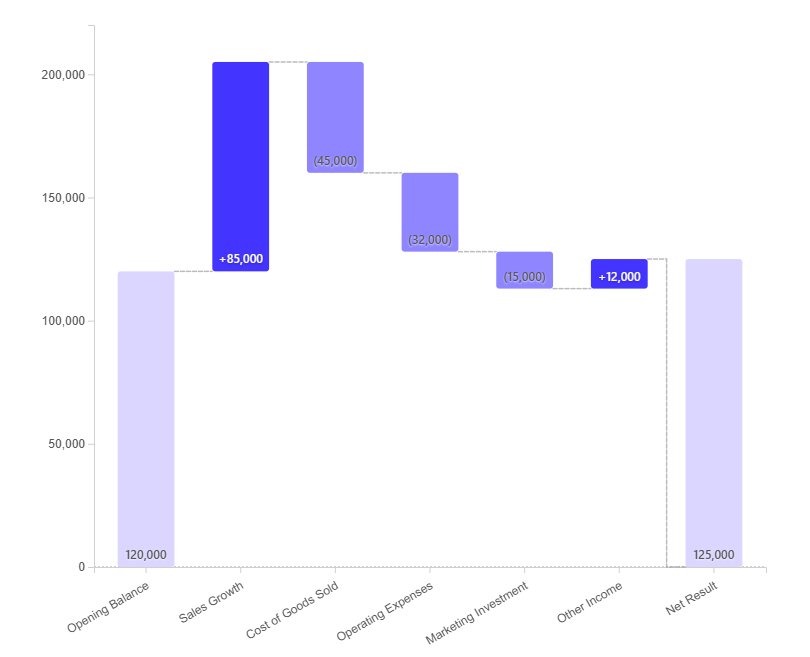

# Custom Chart - Waterfall Chart

A waterfall chart, created with D3.js. A waterfall chart helps you visualize step-by-step changes to an initial value. It's a visual breakdown of how a series of additions and subtractions affect your starting point — whether it's your savings account balance, your project budget, or your company's quarterly profits.

Each element of the waterfall chart serves a specific purpose: 
- Starting value: the first bar in the chart represents the initial value, setting the baseline for subsequent changes. 
- Floating bars: these are the middle bars of the chart, each representing an individual positive or negative change. Positive changes are shown as upward bars and negative changes as downward bars. These bars are "floating" because they begin at the end of the previous bar rather than at the baseline. 
- Ending value: the final bar in the chart shows the ultimate result after all changes have been applied, highlighting the net effect on the initial value. 
- Connectors: these thin lines visually link the end of each floating bar to the beginning of the next bar, helping you trace the progression of the value.

## Using in Luzmo

Upload `bundle.zip` in the Luzmo app in [your Profile settings -> Custom charts](https://app.luzmo.com/settings/custom-charts)

## Development

See Custom Chart Builder repository [luzmo-official/custom-chart-builder](https://github.com/luzmo-official/custom-chart-builder). 

You'll want to copy-paste the `package.json` file and the `src` directory from here into `/projects/custom-chart` of that repository (replacing all existing files).